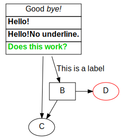

# Scala Library to Produce Graphviz dot-Files

This library provides a (somewhat) type safe interface into the
[Graphviz DOT language](https://graphviz.org/doc/info/lang.html). It provides a case class representation
of the core elements and their attribute.

It isn't a full representation of all legal graphviz
files. It doesn't support the assignment of 
attribute values at arbitrary positions in the code.

Here is an example:

~~~ .scala
object GraphTest {
  def main(args: Array[String]): Unit = {
    val dotString = Graph(
      attributes = GraphAttributes(fontname = "Helvetica", fontsize = 16),
      nodeDefaults = NodeAttributes(fontname = "Helvetica", fontsize = 16),
      edgeDefaults = EdgeAttributes(fontname = "Helvetica", fontsize = 16),
      elements = Seq(
        Node("A", NodeAttributes(
          shape = none,
          label = Table(
            TableAttributes(border = 0, cellSpacing = 0, cellBorder = 1, cellPadding = 3),
            Seq(
              Seq(Cell(TextList(Seq(PlainString("Good "), StyleTag("I",PlainString("bye!")))))),
              Seq(Cell(StyleTag("B", StyleTag("U", PlainString("Hello!"))))),
        )))),
        Node("C"),
        SubGraph(attributes = SubgraphAttributes(rank = same), elements = Seq(
          Node("B",  NodeAttributes(shape = box)),
          Node("D", NodeAttributes(color = Color("#FF0000"))),
        )),
        Edge("A", "B", EdgeAttributes(label = new Plain("This is a label"))),
        Edge("A", "C"),
        Edge("B", "C"),
        Edge("B", "D"),
      )
    ).render

    println(dotString)

    os.write.over(os.pwd / "doc" / "test.dot", dotString)
    os.proc("dot", "-Tsvg", "-o", "doc/test.svg", "doc/test.dot").call()
  }

}
~~~

This will yield the following output:

# TODO

* [ ] Proper String escaping
* [ ] Support for HTML like labels
* [ ] Fix various attribute types e.g. ArrowHead
* [ ] Add support for node ports
* [ ] Separate code that is used to generate code
      from the graphviz schema from the actual 
      library.
* [ ] Convert example into an actual test case.
* [ ] Deploy to maven central.
* [ ] Some attribute grouping mechanism that 
      works across different kinds of attributes.
