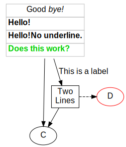

# Scala Library to Produce Graphviz dot-Files

This library provides a (somewhat) type safe interface into the
[Graphviz DOT language](https://graphviz.org/doc/info/lang.html). It provides a case class representation
of the core elements and their attribute.

It isn't a full representation of all legal graphviz
files. It doesn't support the assignment of
attribute values at arbitrary positions in the code.

Here is an example ([full source](core/src/test/scala/berlin/softwaretechnik/graphviz/GraphExample.scala)):

~~~ .scala
val dotString = Graph(
  attributes = GraphAttributes(fontname = "Helvetica", fontsize = 16),
  nodeDefaults = NodeAttributes(fontname = "Helvetica", fontsize = 16),
  edgeDefaults = EdgeAttributes(fontname = "Helvetica", fontsize = 16),
  elements = Seq(
    Node("A", NodeAttributes(
      shape = none,
      label = Table(
        TableAttributes(color = Color("gray"), border = 0, cellSpacing = 0, cellBorder = 1, cellPadding = 3),
        Seq(
          Seq(Cell(TextList(Seq(Plain("Good "), StyleTag("I", Plain("bye!")))))),
          Seq(Cell(TableCellAttributes(align = Align.Left), StyleTag("B", StyleTag("U", Plain("Hello!"))))),
          Seq(Cell(TableCellAttributes(align = Align.Left), b(u("Hello!"),"No underline."))),
          Seq(Cell(TableCellAttributes(align = Align.Left), textAttr(bold = true, color = Color("#00D000"))("Does this work?"))),
        )))),
    Node("C"),
    SubGraph(attributes = SubgraphAttributes(rank = same), elements = Seq(
      Node("B", NodeAttributes(shape = box, label = new Plain("Two\nLines"))),
      Node("D", NodeAttributes(color = Color("#FF0000"))),
    )),
    Edge("A", "B", EdgeAttributes(label = new Plain("This is a label"))),
    Edge("A", "C"),
    Edge("B", "C"),
    Edge("B", "D"),
  )
).render
~~~

This will yield the following output (Click for dot-source):

# TODO
* [ ] Implement basic validation.
* [ ] Implement basic graph transformations. 
* [ ] Implement more missing attribute types.
* [ ] Some attribute grouping mechanism that
      works across different kinds of attributes.
* [ ] Separate code that is used to generate code
      from the graphviz schema from the actual
      library.      |
* [ ] Add support for node port short cut syntax

Done
----
* [X] Deploy to maven central.
* [X] Support for HTML like labels
    * [X] Support font attributes
    * [X] Come up with a nicer model for formatted
          text.
* [X] Fix various attribute types e.g. ArrowHead
* [X] Proper String escaping
* [X] Convert example into an actual test case.

      |